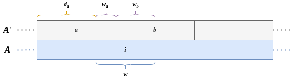

# Word-Packed Integer Vectors for C++

This header-only C++20 library provides implementations for packed (unsigned) integer vectors, that is, vectors consisting of integers represented by an arbitrary number of bits (called *width*). This allows for saving space when storing a large number of integers known to be limited to a universe with a worst-case entropy other than 8, 16, 32 or 64 bits.

Naturally, due to the fact that they are no longer aligned to hardware word sizes, accesses to packed vectors are slower than aligned accesses. This implementation attempts to give accesses as fast as possible. Therefore, depending on your use case, choose the corresponding implementation:

* If your width per integer is *already known at compile time*, use [PackedFixedWidthIntVector](#packedfixedwidthintvector).
* Otherwise, if your width is only known *at runtime*, use [PackedIntVector](#packedintvector).

### Requirements

This library is written in C++20, a corresponding compiler is required. Tests have been done only with GCC 11. Apart from that, the library as no external dependencies. For building the [benchmark](#benchmark) or the [unit tests](#unit-tests), CMake is required.

### License

```
MIT License

Copyright (c) 2022 Patrick Dinklage

Permission is hereby granted, free of charge, to any person obtaining a copy
of this software and associated documentation files (the "Software"), to deal
in the Software without restriction, including without limitation the rights
to use, copy, modify, merge, publish, distribute, sublicense, and/or sell
copies of the Software, and to permit persons to whom the Software is
furnished to do so, subject to the following conditions:

The above copyright notice and this permission notice shall be included in all
copies or substantial portions of the Software.

THE SOFTWARE IS PROVIDED "AS IS", WITHOUT WARRANTY OF ANY KIND, EXPRESS OR
IMPLIED, INCLUDING BUT NOT LIMITED TO THE WARRANTIES OF MERCHANTABILITY,
FITNESS FOR A PARTICULAR PURPOSE AND NONINFRINGEMENT. IN NO EVENT SHALL THE
AUTHORS OR COPYRIGHT HOLDERS BE LIABLE FOR ANY CLAIM, DAMAGES OR OTHER
LIABILITY, WHETHER IN AN ACTION OF CONTRACT, TORT OR OTHERWISE, ARISING FROM,
OUT OF OR IN CONNECTION WITH THE SOFTWARE OR THE USE OR OTHER DEALINGS IN THE
SOFTWARE.
```

### Unit Tests

The library comes with unit tests powered by [doctest](https://github.com/doctest/doctest).

Using CMake, you can build and run the benchmark using the following chain of commands in the repository root:

```sh
mkdir build; cd build
cmake ..
make
make test
```

## Usage

The library is header only, so all you need to do is make sure it's in your include path.

In case you use CMake, you can embed this repository into yours (e.g., as a git submodule) and add it like so:

```cmake
add_subdirectory(path/to/word-packing)
```

You can then link against the `word-packing` interface library, which will automatically add the include directory to your target.

### API

The API is mostly STL compatible; the classes can be used very much like `std::vector` and also use capacity doubling when growing. The most notable exception is that if you construct a packed integer vector with a given size or resize it, the allocated memory is *not* initialized.

Both PackedFixedWidthIntVector and PackedIntVector support integer widths between 1 and the width of your widest available integer (`uintmax_t`), each including. That said, by using a width of 1, the vectors act like bit vectors similar `std::vector<bool>`. However, they have not been optimized for this case and a dedicated bit vector implementation is likely a better choice.

When assigning integers, only the low bits corresponding container's integer width are actually stored. Let's say the container's integer width is 7, and you write the value 255 to some entry (which requires 8 bits), the actually stored integer is 127, corresponding to only the lowest 7 bits.

Both vectors offer to specify the unsigned integer type used to pack integers into. For example, by choosing `uint16_t` as the pack word type, values are packed into 16-bit integers. The width of a pack word must be at least the width of an integer in the container. By default, integers are packed into the widest natively supported integer type (`uintmax_t`).

#### PackedFixedWidthIntVector

Use this class if the integer width is known already at compile time. It is passed as a template parameter.

```cpp
#include <packed_fixed_width_int_vector.hpp>
// ...

pdinklag::PackedFixedWidthIntVector<7> iv(100);
for(int i = 0; i < 100; i++) {
    iv[i] = i;
}
```

#### PackedIntVector

Use this class if the integer width is known already at compile time. It needs to be passed to the constructor.

```cpp
#include <packed_int_vector.hpp>
// ...

pdinklag::PackedIntVector iv(100, 7);
for(int i = 0; i < 100; i++) {
    iv[i] = i;
}
```

It is possible to change the integer width at runtime using a special overload of `resize`:

```cpp
iv.resize(100, 12); // after this operation, each integer has width 12 bits
```

#### UintMin

Sometimes, it is desirable to work with the smallest natively supported integer type that fits a certain number of bits. An example would be to use it as the pack word type and minimize waste. This can be selected using `std::conditional`. This library provides a convenience type used like so:

```cpp
#include <uint_min.hpp>
// ...
using uint7 = UintMin<7>;   // resolves to uint8_t
using uint12 = UintMin<12>; // resolves to uint16_t
using uint32 = UintMin<32>; // resolves to uint32_t
// ...
```

## Benchmark

The library comes with a benchmark that tests the performance of the provided implementations and compares them against the STL counterparts of the packed vectors, `std::vector` (size known at runtime) and `std::array` (size known at compile time).

The benchmark allocates a container for *N* (currently fixed to 100 million) integers and conducts the following operations:

1. Set all integers in *N* to random numbers in sequential order (*set_seq*)
2. Read all integers from *N* in sequential order (*get_seq*)
3. Set all integers in *N* to random numbers  in random order (*set_rnd*)
4. Read all integers from *N* in random order (*get_rnd*)

All random numbers are pregenerated and not included in the measurement; the only measured overhead comes from reading those pregenerated sequences in sequential order, as well as from summing up the read integers to compute a checksum.

Note that on a 64-bit machine, **the benchmark requires 20N bytes &approx; 1.9 GiB of RAM**.

### Building & Running

Using CMake, you can build and run the benchmark using the following chain of commands in the repository root:

```sh
mkdir build; cd build
cmake ..
make benchmark
benchmark/benchmark # run it
```

### Output

The output consists of lines containing pairs of keys and values as described in the following table.

| Key            | Value Description                                            |
| -------------- | ------------------------------------------------------------ |
| `n`            | The benchmark size *N*.                                      |
| `w`            | The width per integer in the container.                      |
| `container`    | The container for which the benchmark was conducted.         |
| `time_set_seq` | The time, in milliseconds, it took to set the *N* integers in sequential order. |
| `time_get_seq` | The time, in milliseconds, it took to read the *N* integers in sequential order. |
| `chk_seq`      | `PASS` if the sum of read values after writing them was correct, `FAIL` otherwise. |
| `time_set_rnd` | The time, in milliseconds, it took to set the *N* integers in random order. |
| `time_get_rnd` | The time, in milliseconds, it took to read the *N* integers in random order. |
| `chk_rnd`      | `PASS` if the sum of read values after writing them was correct, `FAIL` otherwise. |

## Implementation

The core implementation of reading and writing packed containers is found in `int_container_impl.hpp` and consists of the bit twiddling you would imagine. Generally, consider the following figure:



We have an array *A* of integers of width *w* packed into an array *A'* of pack words. When accessing the *i*-th integer, it there are two cases to consider: (1) it is completely contained in the *a*-th pack word, or (2) its low bits are contained in the *a*-th pack word and its high bits are contained in the *b*-th pack word. We compute the number of bits *wa* and *wb* contained in *a* or *b*, respectively (*wa + wb = w* holds), as well as the number *da* of low bits from *a* that we can ignore. Using binary arithmetics, we can use this to read or write the desired integer.

The implementation of this procedure is straightforward. There are two pairs of get and set function implementations: `get_rt / set_rt` are for the case where the width per integer is known only at runtime, whereas `get_ct / set_ct` received the width as a compile-time parameter. In the latter, we further optimize the code for the aligned case, that is, if the integer width divides the width of a pack word.